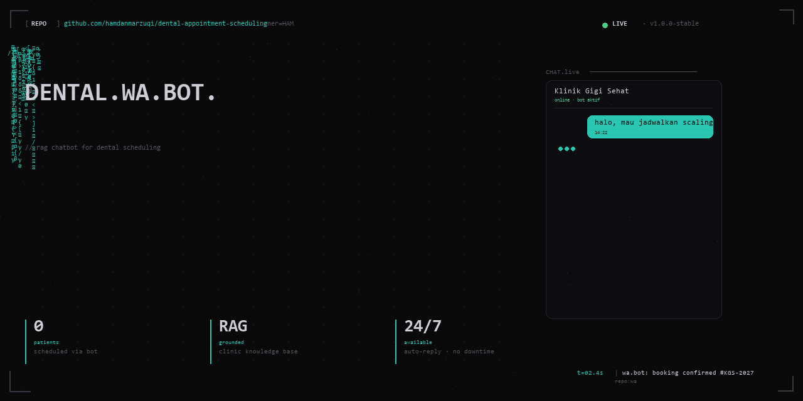

<!-- Drop this at the very top of the repo's README.md -->

  

# Dental Appointment Scheduling (WA Bot)

WhatsApp chatbot for dental clinic scheduling. RAG-grounded to the clinic's knowledge base (services, hours, dentist schedules). Live in production, handling 2+ patients per day through WA conversation.

## Features

- **RAG pipeline** — knowledge base retrieved per query
- **Function calling** — checks availability, books slot, sends confirmation
- **Multi-language** — Indonesian primary, English fallback
- **Live status** — bot online, queue visible

## Stack

`Node.js` `Express` `Groq API` `Llama 3.3 70B` `Google Sheets API` `RAG`

## Status

🟢 **Live in production** — real patients booking daily.
